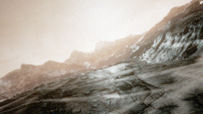

#  AI-Based Autonomous Drone Navigation System

## 📌 Overview
This project implements an AI-based autonomous drone navigation system designed for high-risk environments using Microsoft AirSim and Python.

The system enables intelligent drone movement, obstacle avoidance, real-time mapping, and image capture using drone camera simulation.

---

## 🚀 Features
- Autonomous drone navigation
- A* path planning algorithm
- Obstacle detection using camera input
- Real-time map visualization
- Image capture using drone camera
- Return-to-home (RTH) functionality
- Fully automated execution using master script

---

## 🛠️ Tech Stack
- Python
- AirSim
- OpenCV
- NumPy

---

## 📂 Project Structure
main.py → Main execution

run_project.py → Runs full system

path_planner.py → A* path planning

realtime_map.py → Live tracking

map_visualization.py → Map display

terrain_map.py → Terrain system

images/ → Output screenshots

---

## ▶️ How to Run
1. Install dependencies:
pip install -r requirements.txt

2. Start AirSim simulation

3. Run:python sim10.py
   
---

## 📸 Output Screenshots

---

## 🎯 Future Improvements
- Deep learning-based obstacle detection
- GPS-based navigation
- Multi-drone coordination

---

## 👨‍💻 Author
**Anji Reddy**
